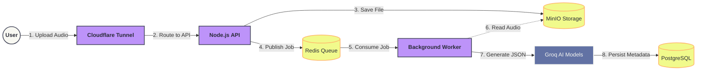

# **🎙️ Voice Memo - AI Powered Transcription**

A robust, secure, and highly scalable cloud-native application for recording, storing, and automatically transcribing voice memos. The system accepts audio files, securely stores them in an S3-compatible Object Storage (MinIO), and leverages a decoupled Background Worker to process Generative AI pipelines (Whisper for transcription and Llama-3 for JSON insight extraction) in real-time.

## **🚀 Technologies & Architecture**

This project was built following **Clean Architecture** principles to ensure strict decoupling, testability, and maintainability.

### **Backend Core (/application/backend)**

* **Runtime:** Node.js (v24) with TypeScript.
* **Architecture:** Clean Architecture with isolated Use Cases, Controllers, and Repositories.
* **Database:** PostgreSQL managed via Prisma ORM.
* **Message Broker:** Redis & BullMQ for asynchronous background job processing.
* **Object Storage:** MinIO (S3 Compatible) for secure audio file persistence via Presigned URLs.
* **AI Pipeline:** Integration with Groq SDK running `whisper-large-v3` for speech-to-text, and `llama3-8b-8192` for structured JSON data extraction.
* **Authentication:** Dual strategy with JWT (JSON Web Token) and Google OAuth2.
* **Validation & Security:** Zod for rigorous schema validation and bcrypt for encryption.
* **Observability:** OpenTelemetry integrated for tracing and monitoring.

### **DevOps & Infrastructure**

* **Docker Orchestration:** Full microservices environment managed via Docker Compose (API, Worker, DB, Redis, Storage, Tunnel).
* **Security (Distroless):** The API and Worker run on **Distroless** Node.js images, drastically reducing the attack surface by removing shells and unnecessary binaries.
* **Network & Ingress:** Cloudflare Tunnels (`cloudflared`) are used to securely expose the API and MinIO storage to the internet without opening VPS ports.
* **CI/CD:** Automated pipelines configured via GitHub Actions for backend integrity checks, including *Shift-Left Security* (Hadolint, Docker Scout, npm audit) and Multi-Stage deployments.

### 📐 Architecture Diagram

## **✨ Key Features**

* **Hybrid Authentication:** Sign up via Email/Password or One-Click Google Login.  
* **Smart Uploads:** Accepts multipart/form-data audio uploads.  
* **Auto-Transcription:** Uploaded audio is immediately processed by AI, generating a full text transcription and a summary title.  
* **Persistent Storage:** Audio files are stored in MinIO buckets, while metadata and transcriptions are indexed in PostgreSQL.  
* **Memo Management:** Complete CRUD operations for voice notes.
* **Asynchronous AI Processing:** Audio uploads are quickly acknowledged by the API and delegated to a Redis queue. A dedicated Worker handles the heavy AI processing without blocking the main thread.
* **AI Insight Extraction:** Beyond transcription, the system uses Llama-3 to automatically generate titles, summaries, and structured JSON representations of the audio content.
* **Secure Presigned URLs:** Files are protected in MinIO. The API generates temporary, cryptographically signed URLs for downloads, protecting the storage layer.
* **Resilient Infrastructure:** Zero-downtime capable structure utilizing multi-stage Docker builds and strict network isolation.

## **🏗️ Infrastructure Services**

The application ecosystem involves the following services orchestrated via Docker:

* **db:** PostgreSQL (Port 5432\)  
* **minio:** Object Storage (Port 9000 / Console 9001\)  
* **migrator:** Ephemeral container for DB setup.  
* **app:** The API Backend (Port 3333\)
* **redis:** Message Broker for BullMQ (Port 6379\)

Also you can find more information how infra is secured by clouflared checking the infra repo [here](https://github.com/athena-devs/infra)
## **📡 API Endpoints**

The following routes are currently implemented and available in the application:

### **🔐 Authentication (/auth)**

| Method | Endpoint | Description | Payload |
| :---- | :---- | :---- | :---- |
| POST | /auth/email | Authenticate with email & password. | { "email": "...", "password": "..." } |
| POST | /auth/google | Authenticate with Google OAuth code. | { "code": "..." } |

### **👤 Users (/users)**

| Method | Endpoint | Access | Description |
| :---- | :---- | :---- | :---- |
| POST | /users | **Public** | Register a new user account. |
| POST | /users/forgot-password | **Private** | Trigger password recovery email.
| GET | /users | **Private** | Retrieve the authenticated user's profile. |
| PATCH | /users | **Private** | Update the authenticated user's profile details. |
| DELETE | /users | **Private** | Permanently delete the user's account and data. |

### **🎙️ Memos (/memos)**

*All memo routes require a valid Bearer Token.*

| Method | Endpoint | Description |
| :---- | :---- | :---- |
| POST | /memos | Upload a new audio file (multipart/form-data). Triggers AI transcription. |
| GET | /memos | Retrieve a list of all memos belonging to the user. |
| GET | /memos/:id | Retrieve details and transcription of a specific memo. |
| PATCH | /memos/:id | Update the title or transcription text of a memo. |
| DELETE | /memos/:id | delete a memo from the database and remove audio from MinIO storage. |

## **📝 Development Status**

* \[x\] Clean Architecture Setup  
* \[x\] Docker Environment (Distroless API & Worker)
* \[x\] Message Broker & Background Jobs (Redis + BullMQ)  
* \[x\] Database Connection & Migrations  
* \[x\] MinIO Storage Integration (Presigned URLs)
* \[x\] Dual AI Integration (Whisper + Llama-3)  
* \[x\] Authentication (JWT + Google OAuth + Password Recovery)  
* \[x\] CI/CD Pipelines & Security Scans (GitHub Actions)
* \[x\] Network Security (Cloudflare Tunnels, see [here](https://github.com/athena-devs/infra)) 
* \[ \] Unit & Integration Tests (Next Step)
* \[ \] Small adjustments  
