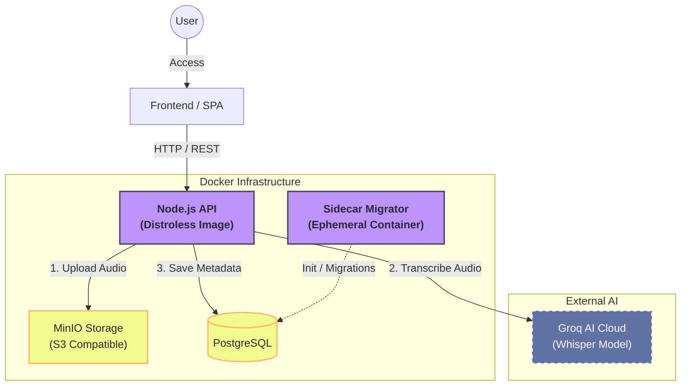

# **🎙️ Voice Memo \- AI Powered Transcription**

🚧 **Work in Progress** 🚧  
A robust, secure, and scalable application for recording, storing, and automatically transcribing voice memos. The system accepts audio files, securely stores them in an S3-compatible Object Storage (MinIO), and leverages Generative AI (Whisper Model via Groq) to transcribe content to text in real-time.

## **🚀 Technologies & Architecture**

This project was built following **Clean Architecture** principles to ensure decoupling, testability, and maintainability.

### **Backend Core (/application/backend)**

* **Runtime:** Node.js (v24) with TypeScript.  
* **Framework:** Express.js.  
* **Database:** PostgreSQL managed via Prisma ORM.  
* **Object Storage:** MinIO (S3 Compatible) for secure audio file persistence.  
* **AI & Transcription:** Integration with Groq SDK (running whisper-large-v3 model) for high-accuracy speech-to-text.  
* **Authentication:** Dual strategy with JWT (JSON Web Token) and Google OAuth2.  
* **Validation:** Zod for rigorous schema validation.

### **DevOps & Infrastructure**

* **Docker Orchestration:** Full environment managed via Docker Compose (App, DB, Storage).  
* **Security (Distroless):** The application runs on a **Distroless** Node.js image, reducing the attack surface by removing shells and unnecessary binaries.  
* **Sidecar Migration Pattern:** Implemented an ephemeral migrator container pattern. Since the main application container is Distroless (and cannot run shell commands), a separate container handles database migrations (prisma db push) before the app starts, ensuring security without sacrificing automation.  
* **CI/CD:** Automated pipelines configured via GitHub Actions for backend integrity checks.

### 📐 Architecture Diagram

## **✨ Key Features**

* **Hybrid Authentication:** Sign up via Email/Password or One-Click Google Login.  
* **Smart Uploads:** Accepts multipart/form-data audio uploads.  
* **Auto-Transcription:** Uploaded audio is immediately processed by AI, generating a full text transcription and a summary title.  
* **Persistent Storage:** Audio files are stored in MinIO buckets, while metadata and transcriptions are indexed in PostgreSQL.  
* **Memo Management:** Complete CRUD operations for voice notes.

## **🏗️ Infrastructure Services**

The application ecosystem involves the following services orchestrated via Docker:

* **db:** PostgreSQL (Port 5432\)  
* **minio:** Object Storage (Port 9000 / Console 9001\)  
* **migrator:** Ephemeral container for DB setup.  
* **app:** The API Backend (Port 3333\)

## **📡 API Endpoints**

The following routes are currently implemented and available in the application:

### **🔐 Authentication (/auth)**

| Method | Endpoint | Description | Payload |
| :---- | :---- | :---- | :---- |
| POST | /auth/email | Authenticate with email & password. | { "email": "...", "password": "..." } |
| POST | /auth/google | Authenticate with Google OAuth code. | { "code": "..." } |

### **👤 Users (/users)**

| Method | Endpoint | Access | Description |
| :---- | :---- | :---- | :---- |
| POST | /users | **Public** | Register a new user account. |
| GET | /users/me | **Private** | Retrieve the authenticated user's profile. |
| PATCH | /users/me | **Private** | Update the authenticated user's profile details. |
| DELETE | /users/me | **Private** | Permanently delete the user's account and data. |

### **🎙️ Memos (/memos)**

*All memo routes require a valid Bearer Token.*

| Method | Endpoint | Description |
| :---- | :---- | :---- |
| POST | /memos | Upload a new audio file (multipart/form-data). Triggers AI transcription. |
| GET | /memos | Retrieve a list of all memos belonging to the user. |
| GET | /memos/:id | Retrieve details and transcription of a specific memo. |
| PATCH | /memos/:id | Update the title or transcription text of a memo. |
| DELETE | /memos/:id | delete a memo from the database and remove audio from MinIO storage. |

## **📝 Development Status**

* \[x\] Clean Architecture Setup  
* \[x\] Docker Environment (Distroless \+ Sidecar)  
* \[x\] Database Connection & Migrations  
* \[x\] MinIO Storage Integration  
* \[x\] AI Integration (Groq/Whisper)  
* \[x\] Authentication (JWT \+ Google)  
* \[x\] CI/CD Pipelines (GitHub Actions)  
* \[ \] Frontend Interface (In Progress)  
* \[ \] Unit & Integration Tests (Next Step)
